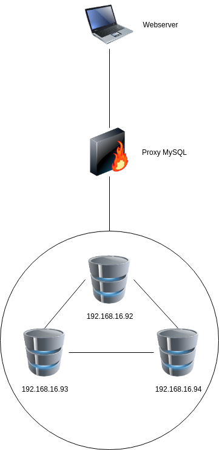
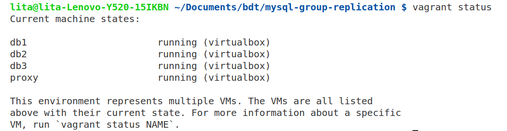
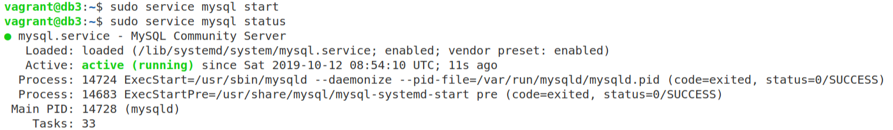

# BDT - ETS

## Desain dan Implementasi Infrastruktur

### Desain Infrastruktur 


   * Gambar Infrastruktur
  
   
    
   * Jumlah Server
    
     * Database sebanyak 3 buah
      
     * Proxy sebanyak 1 buah
      
     * Web server sebanyak 1 buah
     
   * Spesifikasi Hardware
     
      * Database
        
        * Menggunakan bento/ubuntu-16.04
        * RAM 512MB
        * MySQL
      
      * Proxy
        * Menggunakan bento/ubuntu-16.04
        * RAM 512MB
        * MySQL
    
   * Pembagian IP
    
      * Database
        
        * 192.168.16.92
        * 192.168.16.93
        * 192.168.16.94
        
      * Proxy
        
        * 192.168.16.95
      
      * Webserver
        
        * localhost
        
### Implementasi Infrastruktur
    
   * Aplikasi yang harus digunakan
     
     * Vagrant
     * Oracle VM VirtualBox
     
   * Langkah - langkah implementasi
   
     1. Menginisialisasi Vagrantfile
     
        ```bash
        vagrant init
        ```
        
        Lalu Vagrantfile diisi sebagai berikut:
        
        ```ruby
         # -*- mode: ruby -*-
         # vi: set ft=ruby :

         # All Vagrant configuration is done below. The "2" in Vagrant.configure
         # configures the configuration version (we support older styles for
         # backwards compatibility). Please don't change it unless you know what
         # you're doing.

         Vagrant.configure("2") do |config|

           # MySQL Cluster dengan 3 node
           (1..3).each do |i|
             config.vm.define "db#{i}" do |node|
               node.vm.hostname = "db#{i}"
               node.vm.box = "bento/ubuntu-16.04"
               node.vm.network "private_network", ip: "192.168.16.9#{i+1}"

               # Opsional. Edit sesuai dengan nama network adapter di komputer
               #node.vm.network "public_network", bridge: "Qualcomm Atheros QCA9377 Wireless Network Adapter"

               node.vm.provider "virtualbox" do |vb|
                 vb.name = "db#{i}"
                 vb.gui = false
                 vb.memory = "512"
               end

               node.vm.provision "shell", path: "deployMySQL1#{i}.sh", privileged: false
             end
           end

           config.vm.define "proxy" do |proxy|
             proxy.vm.hostname = "proxy"
             proxy.vm.box = "bento/ubuntu-16.04"
             proxy.vm.network "private_network", ip: "192.168.16.95"
             #proxy.vm.network "public_network",  bridge: "Qualcomm Atheros QCA9377 Wireless Network Adapter"

             proxy.vm.provider "virtualbox" do |vb|
               vb.name = "proxy"
               vb.gui = false
               vb.memory = "512"
             end

             proxy.vm.provision "shell", path: "deployProxySQL.sh", privileged: false
           end

         end

        ```
        
        Script diatas akan membuat infrastuktur basis data terdistribusi sesuai dengan [Desain Infrastuktur](#desain-infrastruktur).
     
     2. Membuat Script Provision
        * DB1 (deployMySQL11.sh)
        ```bash
                 # Changing the APT sources.list to kambing.ui.ac.id
         sudo cp '/vagrant/sources.list' '/etc/apt/sources.list'

         # Updating the repo with the new sources
         sudo apt-get update -y

         # Install required library
         sudo apt-get install libaio1
         sudo apt-get install libmecab2

         # Get MySQL binaries
         curl -OL https://dev.mysql.com/get/Downloads/MySQL-5.7/mysql-common_5.7.23-1ubuntu16.04_amd64.deb
         curl -OL https://dev.mysql.com/get/Downloads/MySQL-5.7/mysql-community-client_5.7.23-1ubuntu16.04_amd64.deb
         curl -OL https://dev.mysql.com/get/Downloads/MySQL-5.7/mysql-client_5.7.23-1ubuntu16.04_amd64.deb
         curl -OL https://dev.mysql.com/get/Downloads/MySQL-5.7/mysql-community-server_5.7.23-1ubuntu16.04_amd64.deb

         # Setting input for installation
         sudo debconf-set-selections <<< 'mysql-community-server mysql-community-server/root-pass password admin'
         sudo debconf-set-selections <<< 'mysql-community-server mysql-community-server/re-root-pass password admin'

         # Install MySQL Community Server
         sudo dpkg -i mysql-common_5.7.23-1ubuntu16.04_amd64.deb
         sudo dpkg -i mysql-community-client_5.7.23-1ubuntu16.04_amd64.deb
         sudo dpkg -i mysql-client_5.7.23-1ubuntu16.04_amd64.deb
         sudo dpkg -i mysql-community-server_5.7.23-1ubuntu16.04_amd64.deb

         # Allow port on firewall
         sudo ufw allow 33061
         sudo ufw allow 3306

         # Copy MySQL configurations
         sudo cp /vagrant/my11.cnf /etc/mysql/my.cnf

         # Restart MySQL services
         sudo service mysql restart

         # Cluster bootstrapping
         sudo mysql -u root -padmin < /vagrant/cluster_bootstrap.sql
         sudo mysql -u root -padmin < /vagrant/addition_to_sys.sql
         sudo mysql -u root -padmin < /vagrant/create_proxysql_user.sql
        ```
       
        * DB2 (deployMySQL12.sh)
        ```bash
        # Changing the APT sources.list to kambing.ui.ac.id
         sudo cp '/vagrant/sources.list' '/etc/apt/sources.list'

         # Updating the repo with the new sources
         sudo apt-get update -y

         # Install required library
         sudo apt-get install libaio1
         sudo apt-get install libmecab2

         # Get MySQL binaries
         curl -OL https://dev.mysql.com/get/Downloads/MySQL-5.7/mysql-common_5.7.23-1ubuntu16.04_amd64.deb
         curl -OL https://dev.mysql.com/get/Downloads/MySQL-5.7/mysql-community-client_5.7.23-1ubuntu16.04_amd64.deb
         curl -OL https://dev.mysql.com/get/Downloads/MySQL-5.7/mysql-client_5.7.23-1ubuntu16.04_amd64.deb
         curl -OL https://dev.mysql.com/get/Downloads/MySQL-5.7/mysql-community-server_5.7.23-1ubuntu16.04_amd64.deb

         # Setting input for installation
         sudo debconf-set-selections <<< 'mysql-community-server mysql-community-server/root-pass password admin'
         sudo debconf-set-selections <<< 'mysql-community-server mysql-community-server/re-root-pass password admin'

         # Install MySQL Community Server
         sudo dpkg -i mysql-common_5.7.23-1ubuntu16.04_amd64.deb
         sudo dpkg -i mysql-community-client_5.7.23-1ubuntu16.04_amd64.deb
         sudo dpkg -i mysql-client_5.7.23-1ubuntu16.04_amd64.deb
         sudo dpkg -i mysql-community-server_5.7.23-1ubuntu16.04_amd64.deb

         # Allow port on firewall
         sudo ufw allow 33061
         sudo ufw allow 3306

         # Copy MySQL configurations
         sudo cp /vagrant/my12.cnf /etc/mysql/my.cnf

         # Restart MySQL services
         sudo service mysql restart

         # Cluster bootstrapping
         sudo mysql -u root -padmin < /vagrant/cluster_member.sql
        ```
        * DB3 (deployMySQL13.sh)
        ```bash
        # Changing the APT sources.list to kambing.ui.ac.id
         sudo cp '/vagrant/sources.list' '/etc/apt/sources.list'

         # Updating the repo with the new sources
         sudo apt-get update -y

         # Install required library
         sudo apt-get install libaio1
         sudo apt-get install libmecab2

         # Get MySQL binaries
         curl -OL https://dev.mysql.com/get/Downloads/MySQL-5.7/mysql-common_5.7.23-1ubuntu16.04_amd64.deb
         curl -OL https://dev.mysql.com/get/Downloads/MySQL-5.7/mysql-community-client_5.7.23-1ubuntu16.04_amd64.deb
         curl -OL https://dev.mysql.com/get/Downloads/MySQL-5.7/mysql-client_5.7.23-1ubuntu16.04_amd64.deb
         curl -OL https://dev.mysql.com/get/Downloads/MySQL-5.7/mysql-community-server_5.7.23-1ubuntu16.04_amd64.deb

         # Setting input for installation
         sudo debconf-set-selections <<< 'mysql-community-server mysql-community-server/root-pass password admin'
         sudo debconf-set-selections <<< 'mysql-community-server mysql-community-server/re-root-pass password admin'

         # Install MySQL Community Server
         sudo dpkg -i mysql-common_5.7.23-1ubuntu16.04_amd64.deb
         sudo dpkg -i mysql-community-client_5.7.23-1ubuntu16.04_amd64.deb
         sudo dpkg -i mysql-client_5.7.23-1ubuntu16.04_amd64.deb
         sudo dpkg -i mysql-community-server_5.7.23-1ubuntu16.04_amd64.deb

         # Allow port on firewall
         sudo ufw allow 33061
         sudo ufw allow 3306

         # Copy MySQL configurations
         sudo cp /vagrant/my13.cnf /etc/mysql/my.cnf

         # Restart MySQL services
         sudo service mysql restart

         # Cluster bootstrapping
         sudo mysql -u root -padmin < /vagrant/cluster_member.sql
        ```
        * ProxySQL/Load Balancer (deployProxySQL.sh)
        ```
        # Changing the APT sources.list to kambing.ui.ac.id
         sudo cp '/vagrant/sources.list' '/etc/apt/sources.list'

         # Updating the repo with the new sources
         sudo apt-get update -y

         cd /tmp
         curl -OL https://github.com/sysown/proxysql/releases/download/v1.4.4/proxysql_1.4.4-ubuntu16_amd64.deb
         curl -OL https://dev.mysql.com/get/Downloads/MySQL-5.7/mysql-common_5.7.23-1ubuntu16.04_amd64.deb
         curl -OL https://dev.mysql.com/get/Downloads/MySQL-5.7/mysql-community-client_5.7.23-1ubuntu16.04_amd64.deb
         curl -OL https://dev.mysql.com/get/Downloads/MySQL-5.7/mysql-client_5.7.23-1ubuntu16.04_amd64.deb

         sudo apt-get install libaio1
         sudo apt-get install libmecab2

         sudo dpkg -i proxysql_1.4.4-ubuntu16_amd64.deb
         sudo dpkg -i mysql-common_5.7.23-1ubuntu16.04_amd64.deb
         sudo dpkg -i mysql-community-client_5.7.23-1ubuntu16.04_amd64.deb
         sudo dpkg -i mysql-client_5.7.23-1ubuntu16.04_amd64.deb

         sudo ufw allow 33061
         sudo ufw allow 3306

         sudo systemctl start proxysql
         # mysql -u admin -padmin -h 127.0.0.1 -P 6032 < /vagrant/proxysql.sql
        ```
     3. Membuat File Konfigurasi SQL
        * Generate gtid
        
        ```
        uuidgen
        ```
        
        Lalu masukkan pada `loose-group_replication_group_name` di semua file konfigurasi.
        * db1 (my11.cnf)
        ```ini
        #
         # The MySQL database server configuration file.
         #
         # You can copy this to one of:
         # - "/etc/mysql/my.cnf" to set global options,
         # - "~/.my.cnf" to set user-specific options.
         # 
         # One can use all long options that the program supports.
         # Run program with --help to get a list of available options and with
         # --print-defaults to see which it would actually understand and use.
         #
         # For explanations see
         # http://dev.mysql.com/doc/mysql/en/server-system-variables.html

         #
         # * IMPORTANT: Additional settings that can override those from this file!
         #   The files must end with '.cnf', otherwise they'll be ignored.
         #

         !includedir /etc/mysql/conf.d/
         !includedir /etc/mysql/mysql.conf.d/

         [mysqld]

         # General replication settings
         gtid_mode = ON
         enforce_gtid_consistency = ON
         master_info_repository = TABLE
         relay_log_info_repository = TABLE
         binlog_checksum = NONE
         log_slave_updates = ON
         log_bin = binlog
         binlog_format = ROW
         transaction_write_set_extraction = XXHASH64
         loose-group_replication_bootstrap_group = OFF
         loose-group_replication_start_on_boot = ON
         loose-group_replication_ssl_mode = REQUIRED
         loose-group_replication_recovery_use_ssl = 1

         # Shared replication group configuration
         loose-group_replication_group_name = "11209d17-b6b0-43bf-87aa-9249a53b4b6b"
         loose-group_replication_ip_whitelist = "192.168.16.92, 192.168.16.93, 192.168.16.94"
         loose-group_replication_group_seeds = "192.168.16.92:33061, 192.168.16.93:33061, 192.168.16.94:33061"

         # Single or Multi-primary mode? Uncomment these two lines
         # for multi-primary mode, where any host can accept writes
         loose-group_replication_single_primary_mode = OFF
         loose-group_replication_enforce_update_everywhere_checks = ON

         # Host specific replication configuration
         server_id = 11
         bind-address = "192.168.16.92"
         report_host = "192.168.16.92"
         loose-group_replication_local_address = "192.168.16.92:33061"
        ```
        * db2 (my12.cnf)
        ```ini
        #
         # The MySQL database server configuration file.
         #
         # You can copy this to one of:
         # - "/etc/mysql/my.cnf" to set global options,
         # - "~/.my.cnf" to set user-specific options.
         # 
         # One can use all long options that the program supports.
         # Run program with --help to get a list of available options and with
         # --print-defaults to see which it would actually understand and use.
         #
         # For explanations see
         # http://dev.mysql.com/doc/mysql/en/server-system-variables.html

         #
         # * IMPORTANT: Additional settings that can override those from this file!
         #   The files must end with '.cnf', otherwise they'll be ignored.
         #

         !includedir /etc/mysql/conf.d/
         !includedir /etc/mysql/mysql.conf.d/

         [mysqld]

         # General replication settings
         gtid_mode = ON
         enforce_gtid_consistency = ON
         master_info_repository = TABLE
         relay_log_info_repository = TABLE
         binlog_checksum = NONE
         log_slave_updates = ON
         log_bin = binlog
         binlog_format = ROW
         transaction_write_set_extraction = XXHASH64
         loose-group_replication_bootstrap_group = OFF
         loose-group_replication_start_on_boot = ON
         loose-group_replication_ssl_mode = REQUIRED
         loose-group_replication_recovery_use_ssl = 1

         # Shared replication group configuration
         loose-group_replication_group_name = "11209d17-b6b0-43bf-87aa-9249a53b4b6b"
         loose-group_replication_ip_whitelist = "192.168.16.92, 192.168.16.93, 192.168.16.94"
         loose-group_replication_group_seeds = "192.168.16.92:33061, 192.168.16.93:33061, 192.168.16.94:33061"

         # Single or Multi-primary mode? Uncomment these two lines
         # for multi-primary mode, where any host can accept writes
         loose-group_replication_single_primary_mode = OFF
         loose-group_replication_enforce_update_everywhere_checks = ON

         # Host specific replication configuration
         server_id = 12
         bind-address = "192.168.16.93"
         report_host = "192.168.16.93"
         loose-group_replication_local_address = "192.168.16.93:33061"
        ```
        * db3 (my13.cnf)
        ```ini
        #
         # The MySQL database server configuration file.
         #
         # You can copy this to one of:
         # - "/etc/mysql/my.cnf" to set global options,
         # - "~/.my.cnf" to set user-specific options.
         # 
         # One can use all long options that the program supports.
         # Run program with --help to get a list of available options and with
         # --print-defaults to see which it would actually understand and use.
         #
         # For explanations see
         # http://dev.mysql.com/doc/mysql/en/server-system-variables.html

         #
         # * IMPORTANT: Additional settings that can override those from this file!
         #   The files must end with '.cnf', otherwise they'll be ignored.
         #

         !includedir /etc/mysql/conf.d/
         !includedir /etc/mysql/mysql.conf.d/

         [mysqld]

         # General replication settings
         gtid_mode = ON
         enforce_gtid_consistency = ON
         master_info_repository = TABLE
         relay_log_info_repository = TABLE
         binlog_checksum = NONE
         log_slave_updates = ON
         log_bin = binlog
         binlog_format = ROW
         transaction_write_set_extraction = XXHASH64
         loose-group_replication_bootstrap_group = OFF
         loose-group_replication_start_on_boot = ON
         loose-group_replication_ssl_mode = REQUIRED
         loose-group_replication_recovery_use_ssl = 1

         # Shared replication group configuration
         loose-group_replication_group_name = "11209d17-b6b0-43bf-87aa-9249a53b4b6b"
         loose-group_replication_ip_whitelist = "192.168.16.92, 192.168.16.93, 192.168.16.94"
         loose-group_replication_group_seeds = "192.168.16.92:33061, 192.168.16.93:33061, 192.168.16.94:33061"

         # Single or Multi-primary mode? Uncomment these two lines
         # for multi-primary mode, where any host can accept writes
         loose-group_replication_single_primary_mode = OFF
         loose-group_replication_enforce_update_everywhere_checks = ON

         # Host specific replication configuration
         server_id = 13
         bind-address = "192.168.16.94"
         report_host = "192.168.16.94"
         loose-group_replication_local_address = "192.168.16.94:33061"
        ```
     4. Membuat File Script SQL
        * Patch script untuk ProxySQL (addition_to_sys.sql)
        ```sql
         USE sys;

         DELIMITER $$

         CREATE FUNCTION IFZERO(a INT, b INT)
         RETURNS INT
         DETERMINISTIC
         RETURN IF(a = 0, b, a)$$

         CREATE FUNCTION LOCATE2(needle TEXT(10000), haystack TEXT(10000), offset INT)
         RETURNS INT
         DETERMINISTIC
         RETURN IFZERO(LOCATE(needle, haystack, offset), LENGTH(haystack) + 1)$$

         CREATE FUNCTION GTID_NORMALIZE(g TEXT(10000))
         RETURNS TEXT(10000)
         DETERMINISTIC
         RETURN GTID_SUBTRACT(g, '')$$

         CREATE FUNCTION GTID_COUNT(gtid_set TEXT(10000))
         RETURNS INT
         DETERMINISTIC
         BEGIN
           DECLARE result BIGINT DEFAULT 0;
           DECLARE colon_pos INT;
           DECLARE next_dash_pos INT;
           DECLARE next_colon_pos INT;
           DECLARE next_comma_pos INT;
           SET gtid_set = GTID_NORMALIZE(gtid_set);
           SET colon_pos = LOCATE2(':', gtid_set, 1);
           WHILE colon_pos != LENGTH(gtid_set) + 1 DO
              SET next_dash_pos = LOCATE2('-', gtid_set, colon_pos + 1);
              SET next_colon_pos = LOCATE2(':', gtid_set, colon_pos + 1);
              SET next_comma_pos = LOCATE2(',', gtid_set, colon_pos + 1);
              IF next_dash_pos < next_colon_pos AND next_dash_pos < next_comma_pos THEN
                SET result = result +
                  SUBSTR(gtid_set, next_dash_pos + 1,
                         LEAST(next_colon_pos, next_comma_pos) - (next_dash_pos + 1)) -
                  SUBSTR(gtid_set, colon_pos + 1, next_dash_pos - (colon_pos + 1)) + 1;
              ELSE
                SET result = result + 1;
              END IF;
              SET colon_pos = next_colon_pos;
           END WHILE;
           RETURN result;
         END$$

         CREATE FUNCTION gr_applier_queue_length()
         RETURNS INT
         DETERMINISTIC
         BEGIN
           RETURN (SELECT sys.gtid_count( GTID_SUBTRACT( (SELECT
         Received_transaction_set FROM performance_schema.replication_connection_status
         WHERE Channel_name = 'group_replication_applier' ), (SELECT
         @@global.GTID_EXECUTED) )));
         END$$

         CREATE FUNCTION gr_member_in_primary_partition()
         RETURNS VARCHAR(3)
         DETERMINISTIC
         BEGIN
           RETURN (SELECT IF( MEMBER_STATE='ONLINE' AND ((SELECT COUNT(*) FROM
         performance_schema.replication_group_members WHERE MEMBER_STATE != 'ONLINE') >=
         ((SELECT COUNT(*) FROM performance_schema.replication_group_members)/2) = 0),
         'YES', 'NO' ) FROM performance_schema.replication_group_members JOIN
         performance_schema.replication_group_member_stats USING(member_id));
         END$$

         CREATE VIEW gr_member_routing_candidate_status AS SELECT
         sys.gr_member_in_primary_partition() as viable_candidate,
         IF( (SELECT (SELECT GROUP_CONCAT(variable_value) FROM
         performance_schema.global_variables WHERE variable_name IN ('read_only',
         'super_read_only')) != 'OFF,OFF'), 'YES', 'NO') as read_only,
         sys.gr_applier_queue_length() as transactions_behind, Count_Transactions_in_queue as 'transactions_to_cert' from performance_schema.replication_group_member_stats;$$

         DELIMITER ;

        ```
        * Bootstrapping MySQL group replication, dijalankan hanya pada DB1 (cluster_bootstrap.sql)
        ```
         SET SQL_LOG_BIN=0;
         CREATE USER 'repl'@'%' IDENTIFIED BY 'password' REQUIRE SSL;
         GRANT REPLICATION SLAVE ON *.* TO 'repl'@'%';
         FLUSH PRIVILEGES;
         SET SQL_LOG_BIN=1;
         CHANGE MASTER TO MASTER_USER='repl', MASTER_PASSWORD='password' FOR CHANNEL 'group_replication_recovery';
         INSTALL PLUGIN group_replication SONAME 'group_replication.so';

         SET GLOBAL group_replication_bootstrap_group=ON;
         START GROUP_REPLICATION;
         SET GLOBAL group_replication_bootstrap_group=OFF;

         CREATE DATABASE mybuffet;

        ```
        * Konfigurasi MySQL group replication pada db lainnya (cluster_member.sql)
        ```sql
         SET SQL_LOG_BIN=0;
         CREATE USER 'repl'@'%' IDENTIFIED BY 'password' REQUIRE SSL;
         GRANT REPLICATION SLAVE ON *.* TO 'repl'@'%';
         FLUSH PRIVILEGES;
         SET SQL_LOG_BIN=1;
         CHANGE MASTER TO MASTER_USER='repl', MASTER_PASSWORD='password' FOR CHANNEL 'group_replication_recovery';
         INSTALL PLUGIN group_replication SONAME 'group_replication.so';
        ```
        * Membuat user pada ProxySQL (create_proxysql_user.sql)
        ```sql
         CREATE USER 'monitor'@'%' IDENTIFIED BY 'monitorpassword';
         GRANT SELECT on sys.* to 'monitor'@'%';
         FLUSH PRIVILEGES;

         CREATE USER 'mybuffet'@'%' IDENTIFIED BY '123';
         GRANT ALL PRIVILEGES on mybuffet.* to 'mybuffet'@'%';
         FLUSH PRIVILEGES;
        ```

   * Menjalankan Vagrant
     
     Jalankan command
     ```bash
     vagrant up
     ```
     Cek status vagrant dengan menjalankan command
     ```bash
     vagrant status
     ```
     Akan didapatkan tampilan sebagai berikut
     
     Masuk ke proxy dengan menjalankan command
     ```bash
     vagrant ssh proxy
     ```
     
     Lalu masuk ke mysql dan jalankan command berikut untuk memasukkan user dan daftar server agar dikenali proxy
     ```bash
     mysql -u admin -padmin -h 127.0.0.1 -P 6032 < /vagrant/proxysql.sql
     ```
## Penggunaan Basis Data Terdistribusi dalam Aplikasi

### Konfigurasi aplikasi tambahan
* Masuk ke folder project `my-buffet`
* Ubah .env pada project aplikasi pada bagian
  ```ini
  DB_CONNECTION=mysql
  DB_HOST=192.168.16.95
  DB_PORT=6033
  DB_DATABASE=mybuffet
  DB_USERNAME=mybuffet
  DB_PASSWORD=123
  ```
  `DB_HOST` diisi dengan ip proxysql

  `DB_USERNAME` diisi dengan username yang telah dibuat pada file `proxysql.sql`
* Jalankan command berikut untuk mempersiapkan aplikasi
  ```
  composer install
  php artisan key:generate
  php artisan migrate:fresh
  ```
  
* Untuk menjalankan aplikasi
  ```
  php artisan serve
  ```
  Lalu buka `127.0.0.1:8000`

  

### Deskripsi Aplikasi
MyBuffet adalah sebuah aplikasi untuk menjual makanan hotel dengan harga yang lebih murah karena sudah melewati jam operasional hotel. Aplikasi ini berbasis web dan menggunakan framework Laravel dengan MySQL sebagai databasenya.

## Simulasi Fail Over
### Mematikan Salah Satu Server Database
* Matikan db3
  Buka db3
  ```bash
  vagrant ssh db3
  ```
  Matikan MySQL
  ```bash
  sudo service mysql stop
  sudo service mysql status
  ```
  
  Keluar dari db3 lalu buka proxy
  ```bash
  vagrant ssh proxy
  ```
  Lalu masuk ke MySQL dengan command
  ```
  mysql -u admin -ppassword -h 127.0.0.1 -P 6032 --prompt='ProxySQLAdmin>'
  ```
  Kemudian jalankan query MySQL
  ```sql
  SELECT hostgroup_id, hostname, status FROM runtime_mysql_servers;
  ```
  
  Pada gambar di atas, ip milik proxy `192.168.16.94` memiliki status `SHUNNED`
  
### Mencoba Insert Data

### Menjalankan Kembali MySQL pada db3
* Masuk ke db3
  ```bash
  vagrant ssh db3
  ```
* Nyalakan MySQL
  ```bash
  sudo service mysql start
  sudo service mysql status
  ```
  
* Masuk ke mysql
  ```bash
  mysql -u mybuffet -p123
  ```
  
* Jalankan query berikut untuk mengecek apakah data terreplikasi
  ```sql
  use mybuffet;
  select * from menu_restaurants \G;
  ```
  
  Pada gambar diatas terlihat bahwa isi database pada server db3 sudah sama dengan data terakhir pada aplikasi.