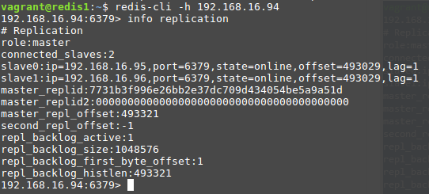

# BDT - Tugas Redis Cluster
## Desain dan Implementasi Infrastruktur
### Desain Infrastruktur
* Jumlah Server
  * Server Wordpress sebanyak `2` buah.
  * Server Redis sebanyak `3` buah.
* Spesifikasi Hardware
  * Server Wordpress
    * Menggunakan `bento/ubuntu-18.04`
    * RAM `512` MB
  * Server Redis
    * Menggunakan `bento/ubuntu-18.04`
    * RAM `512` MB
* Pembagian IP
  * `wordpress1` = `192.168.16.92`
  * `wordpress2` = `192.168.16.93`
  * `redis1` = `192.168.16.94`
  * `redis2` = `192.168.16.95`
  * `redis3` = `192.168.16.96`
### Implementasi Infrastruktur
* Menginisialisasi Vagrantfile
    ```
    vagrant init
    ```
* Modifikasi Vagrantfile
    ```ruby
    # -*- mode: ruby -*-
    # vi: set ft=ruby :

    # All Vagrant configuration is done below. The "2" in Vagrant.configure
    # configures the configuration version (we support older styles for
    # backwards compatibility). Please don't change it unless you know what
    # you're doing.
    Vagrant.configure("2") do |config|

    (1..2).each do |i|
        config.vm.define "wordpress#{i}" do |node|
        node.vm.hostname = "wordpress#{i}"
        node.vm.box = "bento/ubuntu-18.04"
        node.vm.network "private_network", ip: "192.168.16.#{91+i}"
        node.vm.network "public_network", bridge: "enp4s0"

        node.vm.provider "virtualbox" do |vb|
            vb.name = "wordpress#{i}"
            vb.gui = false
            vb.memory = "512"
        end

        node.vm.provision "shell", path: "bash/wordpress.sh", privileged: false
        end
    end

    (1..3).each do |i|
        config.vm.define "redis#{i}" do |node|
        node.vm.hostname = "redis#{i}"
        node.vm.box = "bento/ubuntu-18.04"
        node.vm.network "private_network", ip: "192.168.16.#{93+i}"
        node.vm.network "public_network", bridge: "enp4s0"

        node.vm.provider "virtualbox" do |vb|
            vb.name = "redis#{i}"
            vb.gui = false
            vb.memory = "512"
        end

        node.vm.provision "shell", path: "bash/redis#{i}.sh", privileged: false
        end
    end

    end

    ```
* Membuat script provision
  * Buat script `bash/wordpress.sh` untuk provision server wordpress
    ```bash
    sudo cp /vagrant/sources/hosts /etc/hosts
    sudo cp '/vagrant/sources/sources.list' '/etc/apt/'

    sudo apt update -y

    # Install Apache2
    sudo apt install apache2 -y
    sudo ufw allow in "Apache Full"

    # Install PHP
    sudo apt install php libapache2-mod-php php-mysql php-pear php-dev -y
    sudo a2enmod mpm_prefork && sudo a2enmod php7.0
    sudo pecl install redis
    sudo echo 'extension=redis.so' >> /etc/php/7.2/apache2/php.ini

    # Install MySQL
    sudo debconf-set-selections <<< 'mysql-server mysql-server/root_password password admin'
    sudo debconf-set-selections <<< 'mysql-server mysql-server/root_password_again password admin'
    sudo apt install mysql-server -y
    sudo mysql_secure_installation -y
    sudo ufw allow 3306

    # Configure MySQL for Wordpress
    sudo mysql -u root -padmin < /vagrant/sql/wordpress.sql

    # Install Wordpress
    cd /tmp
    wget -c http://wordpress.org/latest.tar.gz
    tar -xzvf latest.tar.gz
    sudo mkdir -p /var/www/html
    sudo mv wordpress/* /var/www/html
    sudo cp /vagrant/wp-config.php /var/www/html/
    sudo chown -R www-data:www-data /var/www/html/
    sudo chmod -R 755 /var/www/html/
    sudo systemctl restart apache2
    ```
  * Buat script `bash/redis1.sh` untuk provision host `redis1`
    ```bash
    sudo cp /vagrant/sources/hosts /etc/hosts
    sudo cp '/vagrant/sources/sources.list' '/etc/apt/'

    sudo apt update -y

    sudo apt-get install build-essential tcl -y
    sudo apt-get install libjemalloc-dev -y

    curl -O http://download.redis.io/redis-stable.tar.gz
    tar xzvf redis-stable.tar.gz
    cd redis-stable
    make
    # make test
    sudo make install

    sudo mkdir /etc/redis

    sudo cp /vagrant/config/redis1.conf /etc/redis/redis.conf
    sudo cp /vagrant/config/sentinel1.conf /etc/redis-sentinel.conf

    sudo cp /vagrant/service/redis.service /etc/systemd/system/redis.service
    sudo cp /vagrant/service/redisentinel.service /etc/systemd/system/redisentinel.service

    sudo adduser --system --group --no-create-home redis
    sudo mkdir /var/lib/redis
    sudo chown redis:redis /var/lib/redis
    sudo chmod 770 /var/lib/redis

    sudo systemctl start redis
    sudo systemctl status redis

    sudo chmod 777 /etc/redis-sentinel.conf
    sudo systemctl start redisentinel
    sudo systemctl status redisentinel
    ```
  * Buat script `bash/redis2.sh` untuk provision host `redis2`
    ```bash
    sudo cp /vagrant/sources/hosts /etc/hosts
    sudo cp '/vagrant/sources/sources.list' '/etc/apt/'

    sudo apt update -y

    sudo apt-get install build-essential tcl -y
    sudo apt-get install libjemalloc-dev -y

    curl -O http://download.redis.io/redis-stable.tar.gz
    tar xzvf redis-stable.tar.gz
    cd redis-stable
    make
    # make test
    sudo make install

    sudo mkdir /etc/redis

    sudo cp /vagrant/config/redis2.conf /etc/redis/redis.conf
    sudo cp /vagrant/config/sentinel2.conf /etc/redis-sentinel.conf

    sudo cp /vagrant/service/redis.service /etc/systemd/system/redis.service
    sudo cp /vagrant/service/redisentinel.service /etc/systemd/system/redisentinel.service

    sudo adduser --system --group --no-create-home redis
    sudo mkdir /var/lib/redis
    sudo chown redis:redis /var/lib/redis
    sudo chmod 770 /var/lib/redis

    sudo systemctl start redis
    sudo systemctl status redis

    sudo chmod 777 /etc/redis-sentinel.conf
    sudo systemctl start redisentinel
    sudo systemctl status redisentinel
    ```
  * Buat script `bash/redis3.sh` untuk provision host `redis3`
    ```bash
    sudo cp /vagrant/sources/hosts /etc/hosts
    sudo cp '/vagrant/sources/sources.list' '/etc/apt/'

    sudo apt update -y

    sudo apt-get install build-essential tcl -y
    sudo apt-get install libjemalloc-dev -y

    curl -O http://download.redis.io/redis-stable.tar.gz
    tar xzvf redis-stable.tar.gz
    cd redis-stable
    make
    # make test
    sudo make install

    sudo mkdir /etc/redis

    sudo cp /vagrant/config/redis3.conf /etc/redis/redis.conf
    sudo cp /vagrant/config/sentinel3.conf /etc/redis-sentinel.conf

    sudo cp /vagrant/service/redis.service /etc/systemd/system/redis.service
    sudo cp /vagrant/service/redisentinel.service /etc/systemd/system/redisentinel.service

    sudo adduser --system --group --no-create-home redis
    sudo mkdir /var/lib/redis
    sudo chown redis:redis /var/lib/redis
    sudo chmod 770 /var/lib/redis

    sudo systemctl start redis
    sudo systemctl status redis

    sudo chmod 777 /etc/redis-sentinel.conf
    sudo systemctl start redisentinel
    sudo systemctl status redisentinel
    ```
* Membuat file konfigurasi
  * Buat file `config/redis1.conf` untuk konfigurasi redis pada host `redis1`
    ```ini
    bind 192.168.16.94
    port 6379
    dir "/etc/redis"
    ```
  * Buat file `config/redis2.conf` untuk konfigurasi redis pada host `redis2`
    ```ini
    bind 192.168.16.95
    port 6379
    dir "/etc/redis"
    slaveof 192.168.16.94 6379
    ```
  * Buat file `config/redis3.conf` untuk konfigurasi redis pada host `redis3`
    ```ini
    bind 192.168.16.96
    port 6379
    dir "/etc/redis"
    slaveof 192.168.16.94 6379
    ```
  * Buat file `config/sentinel1.conf` untuk konfigurasi sentinel pada host `redis1`
    ```ini
    bind 192.168.16.94
    port 26379

    sentinel monitor redis-cluster 192.168.16.94 6379 2
    sentinel down-after-milliseconds redis-cluster 5000
    sentinel parallel-syncs redis-cluster 1
    sentinel failover-timeout redis-cluster 10000
    ```
  * Buat file `config/sentinel2.conf` untuk konfigurasi sentinel pada host `redis2`
    ```ini
    bind 192.168.16.95
    port 26379

    sentinel monitor redis-cluster 192.168.16.94 6379 2
    sentinel down-after-milliseconds redis-cluster 5000
    sentinel parallel-syncs redis-cluster 1
    sentinel failover-timeout redis-cluster 10000
    ```
  * Buat file `config/sentinel3.conf` untuk konfigurasi sentinel pada host `redis3`
    ```ini
    bind 192.168.16.96
    port 26379

    sentinel monitor redis-cluster 192.168.16.94 6379 2
    sentinel down-after-milliseconds redis-cluster 5000
    sentinel parallel-syncs redis-cluster 1
    sentinel failover-timeout redis-cluster 10000
    ```
* Membuat file pendukung lainnya
  * Buat file `service/redis.service`
    ```ini
    [Unit]
    Description=Redis In-Memory Data Store
    After=network.target

    [Service]
    User=redis
    Group=redis
    ExecStart=/usr/local/bin/redis-server /etc/redis/redis.conf
    ExecStop=/usr/local/bin/redis-cli shutdown
    Restart=always

    [Install]
    WantedBy=multi-user.target
    ```
  * Buat file `service/redisentinel.service`
    ```ini
    [Unit]
    Description=Redis Sentinel
    After=network.target

    [Service]
    User=redis
    Group=redis
    ExecStart=/usr/local/bin/redis-server /etc/redis-sentinel.conf --sentinel
    ExecStop=/usr/local/bin/redis-cli shutdown
    Restart=always

    [Install]
    WantedBy=multi-user.target
    ```
  * Buat file `sql/wordpress.sql`
    ```sql
    CREATE DATABASE wordpress DEFAULT CHARACTER SET utf8 COLLATE utf8_unicode_ci;

    CREATE USER 'wordpress'@'%' IDENTIFIED BY 'wordpress';
    GRANT ALL PRIVILEGES on wordpress.* to 'wordpress'@'%';
    FLUSH PRIVILEGES;
    ```
* Menjalankan command
    ```bash
    vagrant up
    ```
* Mengecek apakah sudah terreplikasi
  * Pada `redis1`
    ```bash
    vagrant ssh redis1
    redis-cli -h 192.168.16.94
    info replication
    ```
  
    
  * Pada `redis2`
    ```bash
    vagrant ssh redis2
    redis-cli -h 192.168.16.95
    info replication
    ```

    
  * Pada `redis3`
    ```bash
    vagrant ssh redis3
    redis-cli -h 192.168.16.96
    info replication
    ```

    
* Menginstall wordpress
  * Buka `192.168.16.92/index.php` dan `192.168.16.93/index.php` kemudian install wordpress
    
  * Install plugin `Redis Cache Object` pada `/wp-admin`
  * Tambahkan konfigurasi pada `wordpress1`
    ```
    sudo nano /var/www/html/wp-config.php
    ```
    Tambahkan sebagai berikut
    ```php
    define('FS_METHOD', 'direct');
    define('WP_REDIS_SENTINEL', 'redis-cluster');
    define('WP_REDIS_SERVERS', ['tcp://192.168.16.94:26379', 'tcp://192.168.16.95:26379', 'tcp://192.168.16.96:26379']);
    ```
  * Cek apakah sudah connected pada bagian `Diagnostics`
    
## Pengujian
* Pengujian menggunakan JMeter
  * Pengujian menggunakan 50 koneksi
    
  * Pengujian menggunakan 192 koneksi
    
  * Pengujian menggunakan 292 koneksi
    
    Kesimpulan :
    Dapat dilihat diatas bahwa wordpress dengan redis lebih lambat dibandingkan dengan wordpress tanpa redis, hal ini bisa jadi disebabkan karena jumlah request ke redis lebih banyak daripada jumlah request ke mysql. Redis dapat dipercepat dengan menambah RAM pada redis atau menambah konten pada page.
* Pengujian Fail Over
  * Mematikan redis pada host `redis1`
    ```bash
    sudo service redis stop
    sudo service redisentinel stop
    ```
  * Pada `redis2`
    ```bash
    vagrant ssh redis2
    redis-cli -h 192.168.16.95
    info replication
    ```
    
  * Pada `redis3`
    ```bash
    vagrant ssh redis3
    redis-cli -h 192.168.16.96
    info replication
    ```
    